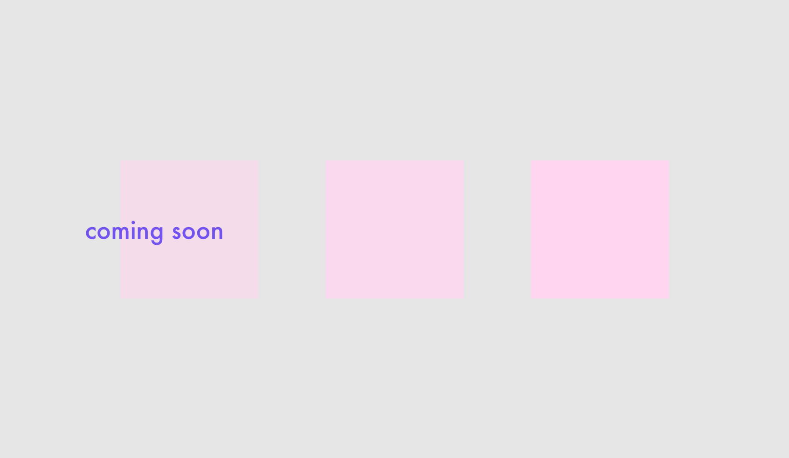

### impo-sture

In this exercise you will train a model to recognize when you are sitting properly in front of your laptop and warn you when you assume a bad posture.
{: .fs-2 }

### drama-stick

In this exercise you will train a model to recognize your gestures and play sounds with them.
{: .fs-2 }

