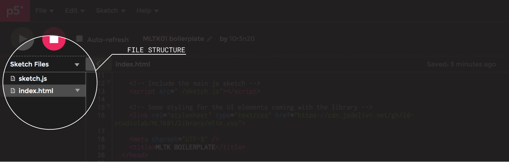
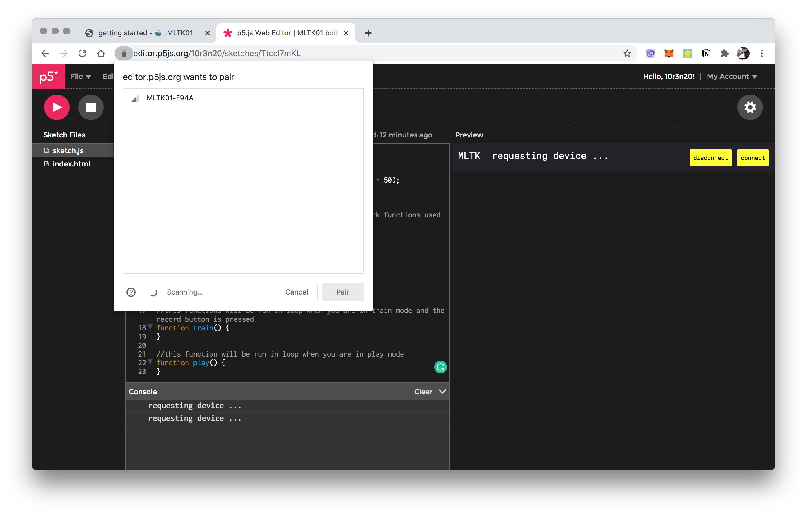

# Getting started
this guide will walk you trough the basics steps you will need to take to create you firts MLTK01 project.

## 0. Prerequisites
If you never had experience with writing a p5.js sketch or any js code I higly reccommend to get familiar it before getting started with this. [Watch a couple of this videos and you will be ready to go](https://www.youtube.com/playlist?list=PLRqwX-V7Uu6Zy51Q-x9tMWIv9cueOFTFA).

## 1. Tools
you will only need the 🤖MLTK01 board and a web browser.

<span class="highlight">currently the web bluetooth api are only supported by Google Chrome so please make sure to run your code with that</span>

You can write the code in your favourite editor or use the handy online [p5.js editor](https://editor.p5js.org/).

## 2. project structure
As any other p5.js sketch you will need to create two main files for your project: index.html and sketch.js




## 3. Importing Libraries
To create our first sketch we will need to import a couple of libraries. Copy paste the following piece of code in your index.html file.

```html
<!DOCTYPE html>
<html>
  <head>
    <!-- Include p5js library -->
    <script src="https://cdnjs.cloudflare.com/ajax/libs/p5.js/1.0.0/p5.js"></script>
    <script src="https://cdnjs.cloudflare.com/ajax/libs/p5.js/1.0.0/addons/p5.sound.min.js"></script>
    <!-- Include ml5js library -->
    <script src="https://unpkg.com/ml5@latest/dist/ml5.min.js" type="text/javascript"></script>
    <!-- Include the MLTK library -->
    <script src="https://cdn.jsdelivr.net/gh/id-studiolab/MLTK01/library/mltk.js"></script>

    <!-- Include the main js sketch -->
    <script src="./sketch.js"></script>

    <!-- Some styling for the UI elements coming with the library -->
    <link rel="stylesheet" type="text/css" href="https://cdn.jsdelivr.net/gh/id-studiolab/MLTK01@latest/library/mltk.min.css">
    <meta charset="UTF-8" />
    <title>MLTK BOILERPLATE</title>
  </head>

    <!-- These 3 divs in the body will be filled in by the library -->
  <body>
    <div id="headerContainer"></div>
    <div id="sketchContainer"></div>
    <div id="ToolsContainer"></div>
  </body>
</html>
```
The code above imports the p5.js, the ml5js and the MLTK library; links our main js sketch file and fetches some stylesheet to render a few UI utilities coming with the MLTK library.
To correctly render the UI elements 3 html divs needs to be created inside the body of the html page.

## 4. js code structure
It's now time to look at the core of the project contained in the js file.

Let's start creating the two main function of any p5.js file: `void setup()` and `void loop()`, to make sure that our p5.js canvas elements will be created inside the sketch container we use the parent function on the canvas element.

```javascript
function setup() {
  var canvas = createCanvas( windowWidth, windowHeight - 50 );
  canvas.parent( 'sketchContainer' );
}

function draw() {
}
```
## 5. the MLTK object
To access the features provided by the MLTK library we need to create a MLTK object.

```javascript
//create a variable to store the mltk object
let mltk;

function setup() {
  var canvas = createCanvas( windowWidth, windowHeight - 50 );
  canvas.parent( 'sketchContainer' );

  //inizialize the mltk object passing the two callback functions used fot training and play mode
  mltk = new MLTK( train, play );
}
```

As you can see, the MLTK constructor function takes two arguments as input, namely two callback functions that will be called accordingly when the board is in train or play mode.  Let's start adding those two function to our sketch, we are going to see later on how to use them.

```javascript
//this functions will be run in loop when you are in train mode and the record button is pressed
function train() {

}

//this function will be run in loop when you are in play mode
function play() {

}
```
Lastly we need a way to initialize the connection between the browser and the board.
Because of the BLE specification, for security issues, the initialization of a ble connection can only be initialized by a user action. Hence, we need to add a button for that.
To simplify the process of creating this simple UI all the time, the MLTK comes with a handy function that creates all the needed interface. add `mltk.createControlInterface();` inside the setup after the constructor function.

Here the full skeleton of our sketch

```javascript
let mltk;
function setup() {
  var canvas = createCanvas(windowWidth, windowHeight - 50);

  canvas.parent('sketchContainer');

  //inizialize the mltk object passing the two callback functions used for training and play mode
  mltk = new MLTK(train, play);

  //add a button to initialize the connection
  mltk.createControlInterface();
}

function draw() {
  background(10);
}

//this functions will be run in loop when you are in train mode and the record button is pressed
function train() {

}

//this function will be run in loop when you are in play mode
function play() {

}
```
By pressing the connect button a popup will appear inviting the user to select ble device to connect to. Don't do anything yet... we will get to it soon. Of course this imply that you have the bluetooth enabled on your device.



## 6. Training the sketch
Now that most of our code skeleton is ready, we can look more in depth at the MLTK api and in particular at the training function.
Firs of all let's shortly recap the main training logic of the toolkit:
- When we are in train mode we can classify data coming from the MLTK board into 8 different classes.
- We can select a specific class by turning the rotary encoder on the board
- The led ring will indicate which class we are going to train
- To actually perform the train we will have to press the "record" button on the board
- As long as the record button is pressed new samples from the sensors will be read and classified with the corresponding class selected via the rotary encoder.

The train function we created earlier will be invoked repeteadly when the board is in train mode and the record button is being pressed. We just need to fill it in with a few line of code:

```javascript
//this functions will be run in loop when you are in train mode and the record button is pressed
function train() {
  //get the label of the class selected from the board
  let label = mltk.getActiveClass();
  //get some data from the board sensor and use it as training features
  let features = mltk.getMagnetometerData();
  mltk.addTrainingData( label, features );
}
```
Let's try to understand what is happening here:
- The `mltk.getActiveClass()` reads the ID of the active class selected trough the rotary encoder and store it in a local variable called `label`
- The `mltk.getMagnetometerData()` collects some sensor data from the board, in this specific example we are fetching the magnetometer data, and stores in the features variable.
- Lastly we invoke the `mltk.addTrainingData( label, features )` which will add the training data to our dataset labelling the dataset with the specified label.
- Keep in mind that <span class="highlight">we can pass any multidimentional array as feature</span> to the addTrainingData function.

## 7. Entering play mode
Now that we covered most of the things that we need to know about the train function we can look at what should happen with the play function.
Similarly to the Train function also the play function is invoked automatically when the board is connected and the mode switch is on "play". In play mode we don't have to use any button to read new datas, the function will be automatically invoked in loop.

Similarly to the train function the play function will need to perform a series of actions:
- Read some data from the sensors;
- Run the classification algorithm on the data to identify to which trained class the data from the sensor is closest to
- light up the corrisponding led on the mltk board.

All this again is done in a few lines of code:

```javascript
//this function will be run in loop when you are in play mode
function play() {
  //get the data you want to "classify"
  let features = mltk.getMagnetometerData();
  //pass the data to the function who does the classification, once done call the "gotResults" callback function
  mltk.classify( features, gotResults );
}

activeClass = 0;

function gotResults( err, result ) {
  if ( err ) {
    console.log( err );
  } else {
    //take the name of the label identified and store it in the global variable activeClass
    activeClass = result.label;
    play();
  }
}
```
Notice that the `mltk.classify( features, gotResults )` function takes two arguments:
- A multidimentional array representing a features
- And a callback fucntion that will be invoked once the classify function will be done running the data trought the created model.

In the code snippet above we added this `gotResults( err, result )` which will be invoked when the classification will be done. The result objects returned by the callback will return the label we used for the training, as well as the probability that the given features belongs to that label.

The library will automatically turn on the appropriate led from the led ring on the board, but to do something with the data it is handy to save the retured label into a global variable. I the code snippet above this is called `activeClass`

## 8. Visualize the label on screen
At this stage the sketch should already be able to interface with the board, train some features and visualize the result from the classification when in play mode. However, to make the example code a bit more complete let's also visualize the selected label on screen.

This can be easily done with a few calls to the p5.js api inside the `draw()` function

```javascript
function draw() {
  // the draw function only draws the active class to the canvas
  background( '#f8db40' );
  textAlign( CENTER );
  textSize( 30 );
  text( activeClass, width / 2, height / 2 );
}
```

## 9. Running the sketch
We are now ready to run the sketch and play with it:
1. Press the connect button on the interface
2. Enter train mode by toggling the mode switch
3. select a class with the rotary encoder and record some samples
4. change the board orientation
5. select a second class and record some more sample
6. set the mode switch to play mode and
7. see the result of the classification on the board and on the screen
8. Hurray!
