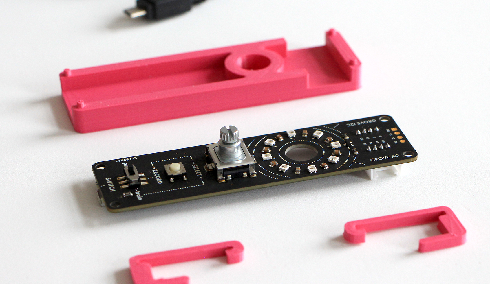

MLTK01 is an open-source toolkit for fast prototyping _tangible learning things_, build on top of [Arduino](https://www.arduino.cc/) and [ml5js](https://ml5js.org/).
{: .fw-300 .fs-6 }

 

 

Simply plug, train and play machine learning sketches.
{: .fw-300 .fs-6 }

This toolkit allows to cut out hardware prototyping time and focus on the design of interactions with tangible learning things, giving space to explorations of unconventional data sources and to the creative craft of behaviors.

As we strive for open approaches to education, we combined hardware and software from two existing open source tools: Arduino and ml5js.
- An [Arduino nano BLE Sense](https://store.arduino.cc/arduino-nano-33-ble-sense) sits on the back of the MLTK01 PCB, functioning as tangible interface and allows to simply plug, train and play machine learning sketches.
- The MLTK01 library extends the [ml5js](https://ml5js.org/) javascript library with a rich set of api to interface the browser with the baord trough [web ble api](https://webbluetoothcg.github.io/web-bluetooth/), facilitating the process of reading sensors and controlling the physical actuators connected to the board.
